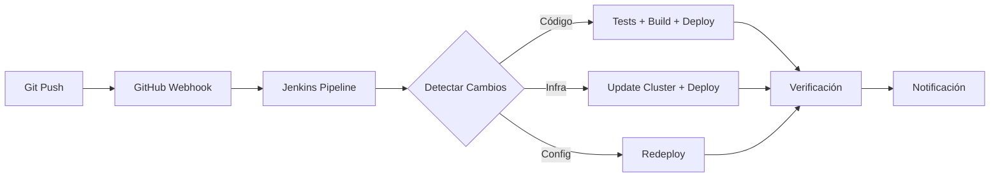
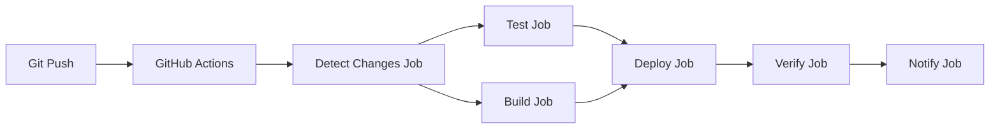

# Comparación: Jenkins vs GitHub Actions

## Resumen Ejecutivo

Este proyecto ahora soporta **dos opciones** para CI/CD:

1. **Jenkins** (incluido) - Control total, self-hosted
2. **GitHub Actions** (ejemplo incluido) - Más simple, cloud-native

## 📊 Comparación Rápida

| Característica  | Jenkins                       | GitHub Actions      |
| --------------- | ----------------------------- | ------------------- |
| **Hospedaje**   | Self-hosted (Docker/K8s)      | GitHub Cloud        |
| **Costo**       | Gratis (paga infraestructura) | 2000 min/mes gratis |
| **Setup**       | ~30 minutos                   | ~5 minutos          |
| **Complejidad** | Media-Alta                    | Baja                |
| **Control**     | Total                         | Limitado            |
| **Plugins**     | +1800 disponibles             | Marketplace         |
| **UI**          | Jenkins UI completa           | GitHub integrado    |
| **Privacidad**  | 100% privado                  | En GitHub           |

## 🎯 ¿Cuál elegir?

### Usa Jenkins si:

- ✅ Necesitas control total sobre el pipeline
- ✅ Tienes requisitos de seguridad estrictos
- ✅ Ya tienes infraestructura Jenkins
- ✅ Necesitas pipelines muy complejos
- ✅ Quieres integrar con muchas herramientas externas
- ✅ Trabajas con múltiples repos/proyectos

### Usa GitHub Actions si:

- ✅ Tu código está en GitHub
- ✅ Quieres algo simple y rápido
- ✅ No quieres mantener infraestructura
- ✅ El límite de 2000 min/mes es suficiente
- ✅ Prefieres configuración declarativa (YAML)
- ✅ Quieres integración nativa con GitHub

## 🚀 Inicio Rápido

### Opción 1: Jenkins (Recomendado para este proyecto)

```bash
cd jenkins
./setup-jenkins.fish docker

# Luego configura:
# 1. Credenciales de GCP
# 2. Pipeline apuntando al Jenkinsfile
# 3. Webhook de GitHub
```

**Ubicación del pipeline:** `Jenkinsfile` en la raíz

### Opción 2: GitHub Actions

```bash
# Copiar el workflow
mkdir -p .github/workflows
cp jenkins/github-actions-example.yml .github/workflows/ci-cd.yml

# Configurar secrets en GitHub:
# Settings → Secrets → Actions → New secret
# - GCP_PROJECT_ID
# - GCP_SA_KEY
# - SLACK_WEBHOOK (opcional)
```

**Ubicación del pipeline:** `.github/workflows/ci-cd.yml`

## 📋 Características Implementadas

### Ambos pipelines incluyen:

| Etapa                | Jenkins     | GitHub Actions |
| -------------------- | ----------- | -------------- |
| Detección de cambios | ✅          | ✅             |
| Tests automatizados  | ✅          | ✅             |
| Build de imágenes    | ✅          | ✅             |
| Push a GCR           | ✅          | ✅             |
| Deploy a GKE         | ✅          | ✅             |
| Verificación         | ✅          | ✅             |
| Reporte de cobertura | ✅          | ✅             |
| Notificaciones       | ⚠️ (manual) | ✅ (Slack)     |
| Rollback             | ⚠️ (manual) | ❌             |
| Multi-ambiente       | ✅          | ✅             |

## 🔧 Configuración Detallada

### Jenkins

#### 1. Credenciales Requeridas

```
ID: gcp-service-account-key
Tipo: Secret File
Contenido: JSON key del service account

ID: gcp-project-id
Tipo: Secret Text
Contenido: ID de tu proyecto GCP
```

#### 2. Crear Service Account

```bash
# Crear SA
gcloud iam service-accounts create jenkins-ci \
  --display-name "Jenkins CI/CD"

# Permisos
gcloud projects add-iam-policy-binding YOUR_PROJECT_ID \
  --member="serviceAccount:jenkins-ci@YOUR_PROJECT_ID.iam.gserviceaccount.com" \
  --role="roles/container.developer"

gcloud projects add-iam-policy-binding YOUR_PROJECT_ID \
  --member="serviceAccount:jenkins-ci@YOUR_PROJECT_ID.iam.gserviceaccount.com" \
  --role="roles/storage.admin"

# Crear key
gcloud iam service-accounts keys create jenkins-sa-key.json \
  --iam-account=jenkins-ci@YOUR_PROJECT_ID.iam.gserviceaccount.com
```

#### 3. Pipeline Job

```groovy
// Jenkins detecta cambios automáticamente
// Define stages condicionales según tipo de cambio
// Ver: Jenkinsfile
```

### GitHub Actions

#### 1. Secrets Requeridos

Ve a: `Settings → Secrets and variables → Actions → New repository secret`

```yaml
Name: GCP_PROJECT_ID
Value: tu-proyecto-gcp

Name: GCP_SA_KEY
Value: |
  {
    "type": "service_account",
    "project_id": "...",
    ...
  }

Name: SLACK_WEBHOOK (opcional)
Value: https://hooks.slack.com/services/xxx/xxx/xxx
```

#### 2. Workflow

```yaml
# Configurado en: .github/workflows/ci-cd.yml
# Se activa en: push, pull_request
# Ver: jenkins/github-actions-example.yml
```

## 🔄 Workflows de Despliegue

### Workflow con Jenkins



### Workflow con GitHub Actions



## 💡 Mejores Prácticas

### Jenkins

1. **Seguridad**

   - Usa Jenkins agents en Kubernetes para escalabilidad
   - Implementa Jenkins Configuration as Code (JCasC)
   - Activa RBAC y limita permisos

2. **Performance**

   - Usa pipeline stages en paralelo
   - Cachea dependencias
   - Limpia workspace regularmente

3. **Mantenimiento**
   - Backups automáticos de configuración
   - Actualiza plugins regularmente
   - Monitorea métricas de Jenkins

### GitHub Actions

1. **Optimización**

   - Usa caching de dependencias
   - Limita runners concurrentes
   - Aprovecha matrix builds

2. **Seguridad**

   - No hardcodees secretos
   - Usa dependabot para updates
   - Limita permisos de workflows

3. **Costo**
   - Monitorea uso de minutos
   - Optimiza jobs para velocidad
   - Considera self-hosted runners

## 📈 Monitoreo y Métricas

### Jenkins

```groovy
// Métricas disponibles en Jenkins:
- Build duration
- Success rate
- Queue time
- Coverage reports (HTML Publisher)
```

Accede a: `http://JENKINS_URL:8080/blue` (Blue Ocean UI)

### GitHub Actions

```yaml
# Métricas en GitHub:
- Workflow runs (Actions tab)
- Timing per job
- Artifacts size
- API usage
```

Accede a: `https://github.com/USER/REPO/actions`

## 🐛 Troubleshooting

### Jenkins

**Problema:** Build falla con "No space left"

```bash
# Solución
docker system prune -a --volumes
```

**Problema:** kubectl connection refused

```bash
# Solución
gcloud container clusters get-credentials CLUSTER --region=REGION
docker cp ~/.kube/config jenkins:/var/jenkins_home/.kube/config
```

### GitHub Actions

**Problema:** Secrets no disponibles

```yaml
# Verificar en Settings → Secrets
# Usar: ${{ secrets.NAME }}
```

**Problema:** Timeout en deploy

```yaml
# Aumentar timeout
timeout-minutes: 30
```

## 🎓 Recursos Adicionales

### Jenkins

- 📚 [Documentación oficial](https://www.jenkins.io/doc/)
- 🎥 [Jenkins Pipeline Tutorial](https://www.jenkins.io/doc/book/pipeline/)
- 🔌 [Plugin Index](https://plugins.jenkins.io/)

### GitHub Actions

- 📚 [Documentación oficial](https://docs.github.com/en/actions)
- 🎥 [GitHub Actions Tutorial](https://docs.github.com/en/actions/learn-github-actions)
- 🛍️ [Marketplace](https://github.com/marketplace?type=actions)

## 🔮 Próximos Pasos

### Mejoras Futuras para Ambos

- [ ] Multi-environment (staging, production)
- [ ] Rollback automático en fallos
- [ ] Blue-green deployments
- [ ] Canary releases
- [ ] Pruebas de integración
- [ ] Security scanning (Trivy, Snyk)
- [ ] Performance testing
- [ ] Slack/Discord notifications
- [ ] Métricas de DORA

## 📝 Conclusión

**Ambas opciones son válidas:**

- **Jenkins** ofrece más control y características avanzadas
- **GitHub Actions** es más simple y rápido de configurar

Para este proyecto, **recomendamos Jenkins** por:

- Mayor control sobre el proceso
- Mejor integración con Ansible
- Infraestructura reutilizable
- Learning experience más completo

Pero **GitHub Actions es perfectamente válido** si prefieres simplicidad.
